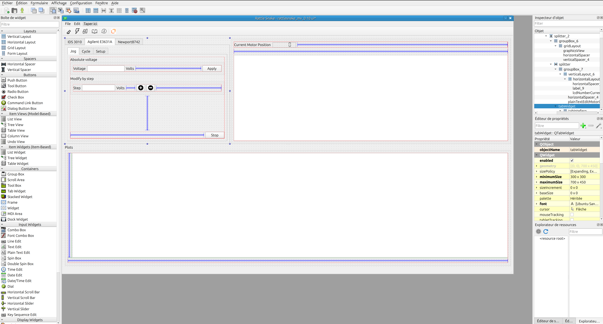

# 🐍 RATTLE SNAKE


**Rattlesnake** is a graphical application based on PyQt designed to create and manage dynamic graphical user interfaces with custom modules.


## Purpose

User interface devoted to control :
- NEWPORT PicoMotor 8742, 
- ATTOCUBE Interferometer IDS3010 and 
- A power supply AGILENT


The code is made to easaly add new wheels to the carosse ! 


## 📦 Installation

To use Rattlesnake, we recommend creating a dedicated Conda environment.

(All the little grey-ish windows below suggest that you are using some command line in a Terminal window)

### 0. Use a setup.py file ???
In the best practice, it would have been convenient to use only 
```
pip install . 
```
But it does not work ! Don't try it at home ! It will come soon or later.


### 1. Clone the repository
Instead... 

```
git clone https://github.com/GregS1t/rattlesnake.git
cd rattlesnake
```

### 2 Create and activate the environment
Make sure you have Conda installed on your machine.
Create the environment using the provided file:

```
conda env create -f environment.yml
conda activate rs_env
```

`environment.yml` contains all the necessary packages to generate the current environment.
The file is already present in the repository you just cloned above.


### 3. Launch the application
From the root of the project:

```
python rattlesnake.py
```

Under Windows, you can create a shortcut to `rattlesnake.bat` to execute it with a double-click. `rattlesnake.bat` just call the previous python command line.

## 📚 Main dependencies
### Python libraries

- Python 3.11
- PyQt
- Matplotlib
- Pandas
- Scikit-learn
- JupyterLab
- Numpy
- PyQtGraph
- Psutil
- PyVisa
- PyUSB --> For the USB Port control
- PyNotifier

All dependencies are automatically installed via Conda and Pip.

## Author / Contact
Grégory Sainton on behalf IPGP and PIONEERS project

## 💬 Notes
### ATTOCUBE interferometer
The ATTOCUBE interferometer drivers are proprietary. Without an explicit purchase of a license, it is not possible to properly control the interferometer through the Rattlesnake interface.

### Newport PicoMotor 8742 lib
This is an internal development. I didn't put the library in a devoted Git repository. 
It's saved in MOTOR directory.  

## On going development
### Main screen at start


More explanation very soon... 


## 📄 License

Distributed under the MIT License – free to use, modify, and distribute.

## ✨ Quick Summary
```
git clone https://github.com/GregS1t/rattlesnake.git
conda env create -f environment.yml
conda activate rs_env && python rattlesnake.py
```

## 🚀 Let's Rattle!

🐍🐍🐍🐍

---
## 🛠️ Development

### Good rules to follow (that i didn't followed...)
If you want to contribute or develop Rattlesnake, several additional tools are included:

- Black for automatic code formatting
- Flake8 for style checking and error detection
- PyInstaller to create standalone executables

### Update the UI interface
All the graphical interface was made using `Qt Designer`

- The current main interface is designed in `rattlesnake_mv_0.10.ui` file (in the `UIDIR` folder). For any change of the content, everything starts within this `.ui` file.
- To add another menu, add another specific `.ui` file.

- The name you will give to the widgets (from QtDesigner) will be used in the code to implement their callback.



### Multithreading

For reasons of fluidity, RattleSnake is multithreaded like most graphics applications. It is important to maintain this mode of operation, otherwise the application's performance would be profoundly altered, particularly as regards instrument control and data acquisition from the various sensors.

### Workflow of the GUI and main features

1. GuiPioneersMainWindow (inherits from QtWidgets.QMainWindow)

Core of the application with:

- Multiple tabbed widgets (one per device),
- Graph plotting using pyqtgraph,
- Connection, configuration, and control logic for each instrument.

#### 2. Motor Control (Newport Picomotor)

Uses Pico8742Ctrl class for low-level USB communication.

Supports:
- Jog motion (free-run in a direction),
- Relative/absolute positioning,
- Cycle execution (repeated back-and-forth movement with dwell time),
- Parameter persistence via session files.

#### 3. Interferometer Control (IDS3010)

Imports gui_interfero.IDS_IPGP and ids_stream.Stream.

Handles:

- Connection and initialization,
- Starting/stopping distance measurement and alignment,
- Data acquisition and real-time plotting,
- Recording data to .aws files.

#### 4. Agilent Power Supply

Uses pyvisa to communicate via VISA resource strings.

Supports:
- Setting voltage/cycle parameters,
- Voltage jogging (manual increase/decrease),
- Voltage cycling (e.g., Vmin → Vmax → Vmin),
- Data recording.