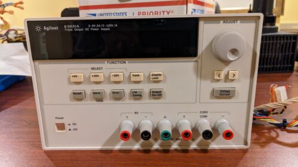

# 🐍 RATTLE SNAKE


**Rattlesnake** is a graphical application based on PyQt designed to create and manage dynamic graphical user interfaces with custom modules.


## Purpose

User interface devoted to control :
- NEWPORT PicoMotor 8742, 
- ATTOCUBE Interferometer IDS3010 and 
- A power supply AGILENT





The code is made to easaly add new wheels to the carosse ! 


## 📦 Installation

To use Rattlesnake, we recommend creating a dedicated Conda environment.

(All the little grey-ish windows below suggest that you are using some command line in a Terminal window)

### 0. Use a setup.py file ???
In the best practice, it would have been convenient to use only 
```
pip install . 
```
But it does not work ! Don't try it at home ! It will come soon or later.


### 1. Clone the repository
Instead... 

```
git clone https://github.com/GregS1t/rattlesnake.git
cd rattlesnake
```

### 2 Create and activate the environment
Make sure you have Conda installed on your machine.
Create the environment using the provided file:

```
conda env create -f environment.yml
conda activate rs_env
```

`environment.yml` contains all the necessary packages to generate the current environment.
The file is already present in the repository you just cloned above.


### 3. Launch the application
From the root of the project:

```
python rattlesnake.py
```

Under Windows, you can create a shortcut to `rattlesnake.bat` to execute it with a double-click. `rattlesnake.bat` just call the previous python command line.

## 📚 Main dependencies
### Python libraries

- Python 3.11
- PyQt
- Matplotlib
- Pandas
- Scikit-learn
- JupyterLab
- Numpy
- PyQtGraph
- Psutil
- PyVisa
- PyUSB --> For the USB Port control
- PyNotifier

All dependencies are automatically installed via Conda and Pip.

## Author / Contact
Grégory Sainton on behalf IPGP and PIONEERS project

## 💬 Notes
### ATTOCUBE interferometer
The ATTOCUBE interferometer drivers are proprietary. Without an explicit purchase of a license, it is not possible to properly control the interferometer through the Rattlesnake interface.

### Newport PicoMotor 8742 lib
This is an internal development. I didn't put the library in a devoted Git repository. 
It's saved in MOTOR directory.  

## On going development
### Main screen at start


More explanation very soon... 


## 📄 License

Distributed under the MIT License – free to use, modify, and distribute.

## ✨ Quick Summary
```
git clone https://github.com/GregS1t/rattlesnake.git
conda env create -f environment.yml
conda activate rs_env && python rattlesnake.py
```

## 🚀 Let's Rattle!

🐍🐍🐍🐍

